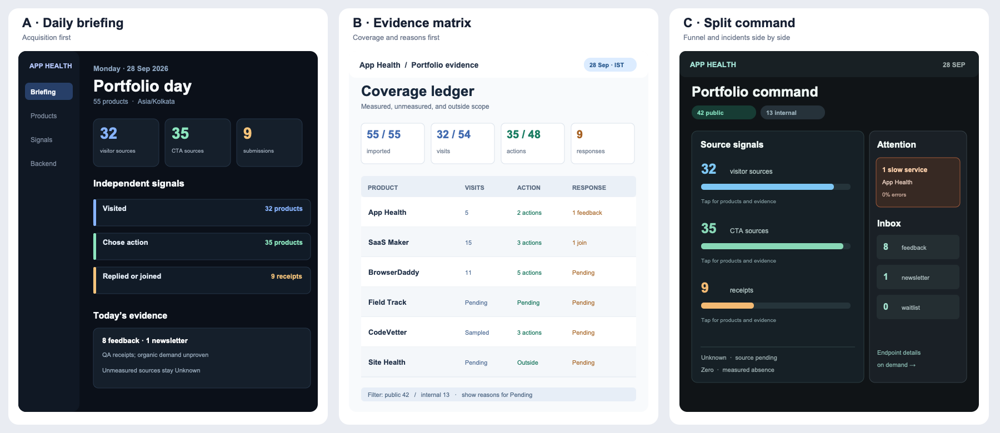

# App Health portfolio dashboard directions

The owner uses App Health to see which Fleet products drew browser attention, which named actions happened, which feedback or consented joins were stored, and whether a measured service issue needs investigation. The daily report covers 55 active products (42 public, 13 internal) by completed Asia/Kolkata day. The September 28 example has 32 products with browser visitor evidence, 35 with CTA evidence, eight feedback receipts, one newsletter receipt, and one measured slow-service issue. Counts reflect qualification and QA traffic; they are not a funnel or proof of organic demand. A missing source remains Unknown, while an inapplicable source is labeled separately.

## A — Daily briefing

- **Job and audience:** Give the owner a quick daily read, then let them inspect products and supporting evidence.
- **System:** A dark editorial report with a persistent narrow sidebar. The completed day, three independent source summaries, and recent receipts lead; service health follows as an investigation path. Restrained system sans type and monospace event IDs match the existing App Health language. Blue means visits, green means actions, and amber means submitted responses; status colors stay separate.
- **Interaction and signature:** Each source summary opens its product rows and receipt details. An explicit “QA evidence” note sits beside the counts. The signature is a dated daily briefing, not a generic KPI wall.
- **Risk:** Users may mistake the three source totals for sequential funnel stages. The implementation must label their units and avoid conversion rates.

## B — Evidence matrix

- **Job and audience:** Let the owner audit every product's coverage and understand why a cell is Pending, measured zero, or outside scope.
- **System:** A light, high-density ledger with a compact header, source coverage ratios, sticky product column, and grouped metric columns. Typography is plain and precise; blue identifies observed visits, green actions, amber submissions, and neutral gray unmeasured states. The public/internal filter is prominent.
- **Interaction and signature:** A cell opens its source receipt, start date, and reason for uncertainty. The signature is a coverage ledger that distinguishes evidence from catalog applicability.
- **Risk:** Dense rows can become tiring on phones. The responsive view needs a product card with the same reason and source detail, not a horizontally clipped table.

## C — Split command

- **Job and audience:** Let the owner scan acquisition and operational attention at once while keeping the internal products out of the default public view.
- **System:** A dark two-column command surface. Independent visit, action, and submission signals occupy the main region; measured incidents and the alert feed form a narrower side rail. Muted teal and blue mark evidence, while orange is reserved for actual attention. Product counts and receipt counts remain explicitly different units.
- **Interaction and signature:** Public/internal chips switch scope. The signal lanes drill into product receipts; the attention rail leads to the exact slow endpoint. The signature is the paired evidence and incident rail.
- **Risk:** The side rail can overemphasize infrastructure and pull attention away from the daily product report. It needs strict incident prioritization and quiet treatment for unconfigured sources.

The existing `DESIGN.md` dark/light system, shadcn components, accessible controls, and honest Unknown/Not applicable distinction remain constraints for the selected direction. These are direction previews, not implemented dashboard states.

The current Watchtower composition was owner-selected on 2026-09-22 and remains the approved baseline. Small accuracy and source-coverage improvements can preserve it; selecting A, B, or C authorizes a larger hierarchy change.
